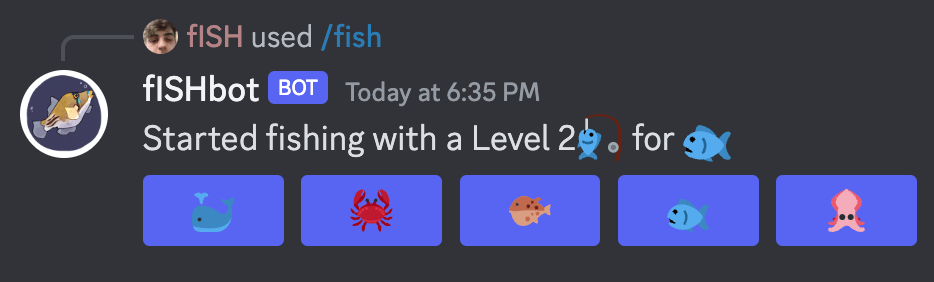

# fISHbot

Revival of my first ever project. See `original/` for the source code from 2017. Recently rediscovered the code & since most of the old Discord API was deprecated & my bot didn't work anymore I took this as a chance to learn Cloudflare workers & familiarize myself with serverless.

Add the bot: https://fishbot.konstfish.workers.dev/

base from https://github.com/discord/cloudflare-sample-app?tab=readme-ov-file
